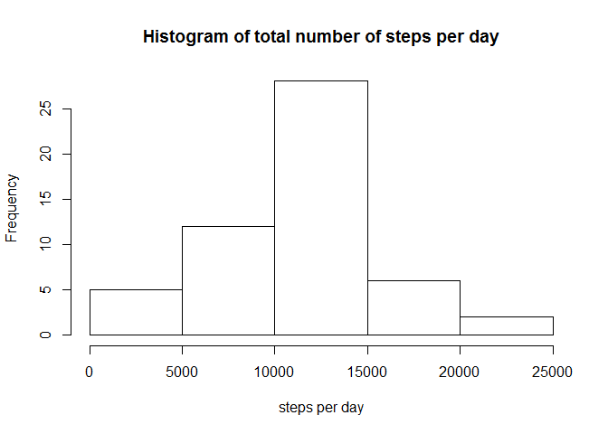
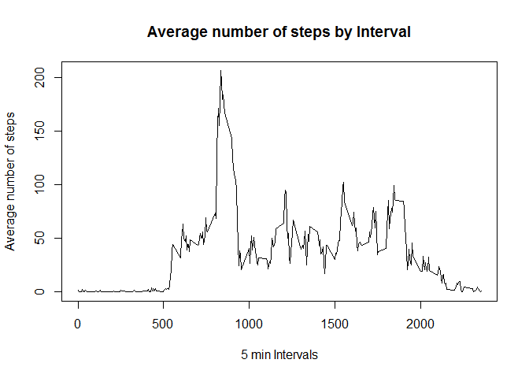
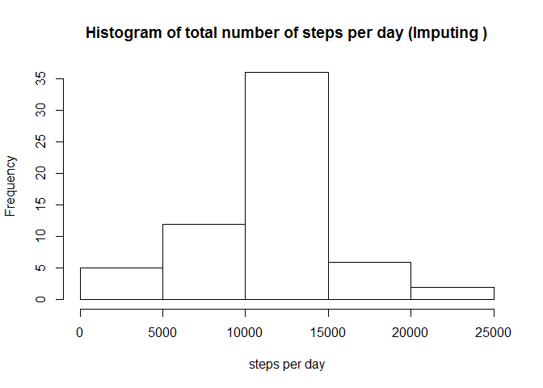
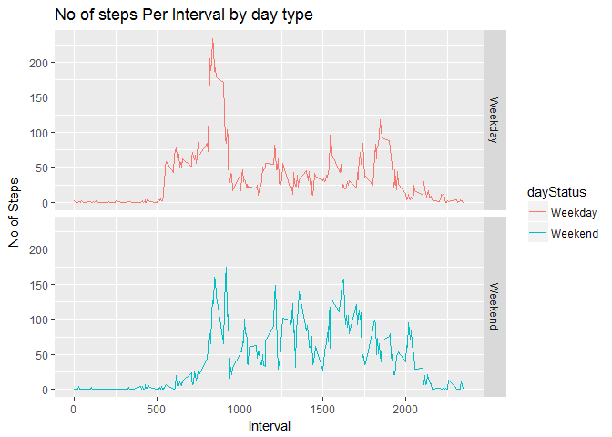

# Reproducible Research: Peer Assessment 1


## Loading and preprocessing the data

### Download the file and unzip if needed 

```r
unZipFileName <- "activity.csv"
if(!file.exists(unZipFileName))
{
fileName<- "repdata_Fdata_Factivity.zip"
  ##chack to see that we didnt allredy downlode and unzip the file 
  if(!file.exists(fileName))
  {
    fileURL<- "https://d396qusza40orc.cloudfront.net/repdata%2Fdata%2Factivity.zip"
    download.file(fileURL,fileName,mode = "wb")
  }
  unzip(fileName)
}
```

### load the file 

```r
activity <- read.csv(unZipFileName)
activity$date <- as.Date(activity$date,format = "%Y-%m-%d" )
activityRemovNA <- activity[complete.cases(activity),]
```


## What is mean total number of steps taken per day?
For this part of the assignment, you can ignore the missing values in the dataset.

1. Calculate the total number of steps taken per day
2. If you do not understand the difference between a histogram and a barplot, research the difference between them. Make a histogram of the total number of steps taken each day
3. Calculate and report the mean and median of the total number of steps taken per day

### Histogram of the total number of step each day

```r
totalStepsPerDay<-aggregate(steps ~ date,activityRemovNA,sum)
hist(totalStepsPerDay$steps,main="Histogram of total number of steps per day",xlab = "steps per day")
```

<!-- -->


### mean and median number of steps per day 

```r
mean(totalStepsPerDay$steps)
```

```
## [1] 10766.19
```

```r
median(totalStepsPerDay$steps)
```

```
## [1] 10765
```
## What is the average daily activity pattern?
1. Make a time series plot of the 5-minute interval (x-axis) and the average number of steps taken, averaged across all days (y-axis)
2. Which 5-minute interval, on average across all the days in the dataset, contains the maximum number of steps?

### 1. Make the plot 

```r
# calculat avg steps per time interval
avgStepsPerInterval <- aggregate(steps~interval,activityRemovNA,mean)
#create the plot 
plot(avgStepsPerInterval$interval, avgStepsPerInterval$steps, type='l', col=1, main="Average number of steps by Interval", xlab="5 min Intervals", ylab="Average number of steps")
```

<!-- -->

### 2. fine the max interval

```r
maxIntervalIndex <- which.max(avgStepsPerInterval$steps)
print(paste("the 5 min interval with the highest avg step is",avgStepsPerInterval[maxIntervalIndex,]$interval,"And the num of steps is",round(avgStepsPerInterval[maxIntervalIndex,]$steps,digits = 1)))
```

```
## [1] "the 5 min interval with the highest avg step is 835 And the num of steps is 206.2"
```
## Imputing missing values

Note that there are a number of days/intervals where there are missing values (coded as ????????). The presence of missing days may introduce bias into some calculations or summaries of the data.

1. Calculate and report the total number of missing values in the dataset (i.e. the total number of rows with ????????s)
2. Devise a strategy for filling in all of the missing values in the dataset. The strategy does not need to be sophisticated. For example, you could use the mean/median for that day, or the mean for that 5-minute interval, etc.
3. Create a new dataset that is equal to the original dataset but with the missing data filled in.
4.Make a histogram of the total number of steps taken each day and Calculate and report the mean and median total number of steps taken per day. Do these values differ from the estimates from the first part of the assignment? What is the impact of imputing missing data on the estimates of the total daily number of steps?


### 1. Calculate and report missing value total num

```r
# Calculate the number of rows with missing values
activityMissingValue <- activity[!complete.cases(activity),]
nrow(activityMissingValue)
```

```
## [1] 2304
```

### 2. Strategy to fill in missing value
I will replace the missing value with the value of the avg of that interval across all day 

### 3. create the new dataset with fill in missing data 


```r
# create a copy of activity 
# go over all missing value and fill in the avg step per interval value 
ActivityFillMisiing <- activity
for(i in 1:nrow(ActivityFillMisiing))
{
  if(is.na(ActivityFillMisiing$steps[i]))
  {
    val <- avgStepsPerInterval$steps[which(avgStepsPerInterval$interval == ActivityFillMisiing$interval[i])]
    ActivityFillMisiing$steps[i] <- val
  }
}
totalStepsPerDayFillMissing <-aggregate(steps ~ date,ActivityFillMisiing,sum)
```

### create a histogram  

```r
#histogram createion
hist(totalStepsPerDayFillMissing$steps,main="Histogram of total number of steps per day (Imputing )",xlab = "steps per day")
```

<!-- -->


### mean and median number of steps per day 

```r
mean(totalStepsPerDayFillMissing$steps)
```

```
## [1] 10766.19
```


```r
median(totalStepsPerDayFillMissing$steps)
```

```
## [1] 10766.19
```
## Are there differences in activity patterns between weekdays and weekends?
For this part the weekdays????????????????????????????????() function may be of some help here. Use the dataset with the filled-in missing values for this part.

1. Create a new factor variable in the dataset with two levels - "weekday" and "weekend" indicating whether a given date is a weekday or weekend day.

2. Make a panel plot containing a time series plot??? = "????") of the 5-minute interval (x-axis) and the average number of steps taken, averaged across all weekday days or weekend days (y-axis). See the README file in the GitHub repository to see an example of what this plot should look like using simulated data.

### 1. create a factor var for weekday and weekend

first we will create a function to assinge a date if he is a weekday or a weekend

```r
AssingWeekDayStatus <- function(dateValue)
{
  dayOfTheWeek <- weekdays(dateValue)
  if  (!(dayOfTheWeek == 'Saturday' || dayOfTheWeek == 'Sunday')) {
        x <- 'Weekday'
    } else {
        x <- 'Weekend'
    }
    return(x)
}
```

then we apply the function to the original dataset

```r
# Apply the AssingWeekDayStatus function and add a new column to activity dataset
activity$dayStatus <- as.factor(sapply(activity$date,AssingWeekDayStatus))

# load the ggplot2 library
library(ggplot2)
```

```
## Warning: package 'ggplot2' was built under R version 3.3.3
```

```r
# Create the aggregated data frame by intervals and dayStatus
avgStepsPerDayAndStatus <- aggregate(steps~interval+dayStatus,activity,mean)

# Create the plot
plt <- ggplot(avgStepsPerDayAndStatus, aes(interval, steps)) +
    geom_line(stat = "identity", aes(colour = dayStatus)) +
    theme_gray() +
    facet_grid(dayStatus ~ ., scales="fixed", space="fixed") +
    labs(x="Interval", y=expression("No of Steps")) +
    ggtitle("No of steps Per Interval by day type")
print(plt)
```

<!-- -->
